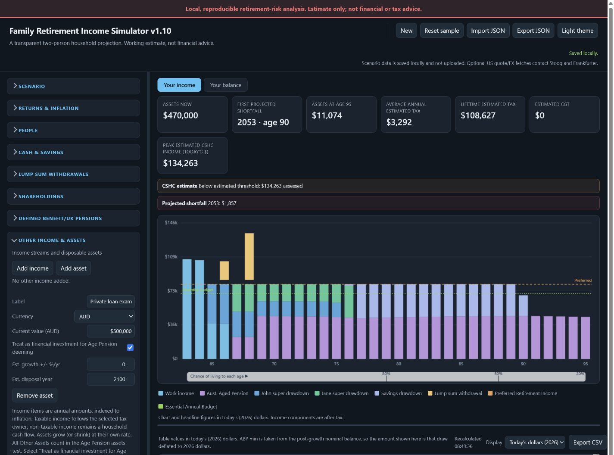

# Retirement Simulator

A transparent, local-first retirement-income modelling tool built primarily for personal use and shared openly in case others find it useful.

The repository contains two self-contained browser tools:

- **Retirement Simulator** — the primary deterministic annual projection.
- **Retirement Monte Carlo Report** — an experimental companion for exploring sequence-of-returns sensitivity.

> **Estimate only. Not financial, tax, legal or investment advice.** The models are simplified, assumptions become stale, and results are not predictions.

## Download

[**Download Retirement Simulator**](https://github.com/dcaddick/retirement-simulator/releases/latest/download/retirement-simulator.html)

Single HTML file · no installation · opens locally in a modern browser.



*Shown with fictional data in the default dark theme. The deterministic v1.10 simulator lets the fictional private-loan example be classified as a financial investment for Age Pension deeming while every Other Asset remains in the assets test. This is a modelling classification, not financial advice.*

## Yours to download and use

Download the HTML files, keep them locally, modify them and use them however the licence permits. There are no accounts, analytics, advertising pixels, trackers, telemetry or background callbacks. Scenario data stays in your browser's local storage.

The only network requests are optional and user-triggered: a US share-price lookup through Stooq and a currency-rate lookup through Frankfurter. The simulator works without either service, and the interface tells you before those requests are used.

## Inspiration

The income-chart concept and survival-context treatment were inspired by the retirement income graphs in [SuperCalcs Retirement Income Simulator](https://supercalcs.com.au/ris9/mst/graphs). This project is an independent implementation with its own transparent assumptions and calculation model; it is not affiliated with or endorsed by SuperCalcs.

## Why this exists

This started as a tool for understanding one household's retirement choices. It is not a commercial product, a regulated calculator or a promise of universal suitability. It is published under an open-source licence so people can inspect it, adapt it, raise issues and propose improvements.

There are no guarantees about support, response times, future maintenance or acceptance of contributions.

## Run it

No server, account or build step is required.

1. Clone or download the repository.
2. Open `retirement-simulator.html` in a modern browser.
3. Start with the fictional sample, create a new scenario or import your own JSON file.
4. Optionally export the scenario and import it into `retirement-monte-carlo-v0.7.html`.

The stable live filename is always `retirement-simulator.html`. Exact sanitized public releases are also retained under [`archive/`](archive/) for regression testing and comparison.

Scenario data stays in the browser's local storage unless you explicitly import or export a file. Both pages include a locally remembered light/dark theme control.

## Retirement Simulator

The deterministic simulator models either a couple or a single-person household and includes:

- salaries, retirement ages and superannuation contributions;
- accumulation and retirement-phase super balances;
- super access from age 60 and ordered drawdown tiers;
- planned lump-sum withdrawals with requested, funded and unfunded audit output plus a separate affordability warning;
- cash, savings, shareholdings, other income and other assets;
- individual Other Asset selection as a financial investment for Age Pension deeming, while every Other Asset remains in the assets test;
- nominal share-price growth, holding-period dividends and optional franking credits by owner;
- per-person capital-loss netting and carry-forward, with CGT funded from assets rather than counted as retirement income;
- Australian income-tax estimates, Medicare, LITO/SAPTO, Age Pension and CSHC estimates, including one partnered share when only one partner has reached Age Pension age;
- Australian defined-benefit and UK State Pension support;
- an optional fixed first-death scenario with immediate survivor spending, ownership, inherited-super, continuing-income, tax and single Age Pension transitions;
- optional per-person salary growth above inflation, defaulting to 0%;
- account-based pension minimum drawdowns;
- Preferred Retirement Income, Essential Annual Budget and surplus banking;
- today's-dollar and nominal-dollar views;
- year-by-year projection tables, visible-table CSV export and inspectable charts;
- local autosave plus JSON import and export.

In **Single** mode, Person 1 is the sole modelled person from the first year. Saved Person 2 details and Person 2-owned records are hidden, preserved for a later switch back to **Couple**, and contribute nothing to calculations or output. Joint 50/50 records contribute only Person 1's 50% share. Single mode uses the entered Preferred Retirement Income and Essential Annual Budget in full, applies single-person tax and government-support rules immediately, and does not trigger first-death, inheritance or survivor-percentage logic. This household-type control is currently deterministic-only; the experimental Monte Carlo companion is unchanged.

Return assumptions and inflation are shown together. The interface calculates the nominal-minus-inflation spread live, showing both the long-run 2.5% view and the near-term Treasury rate when they differ.

An amber dashboard warning makes any unfunded lump-sum amount visible without changing the separate annual-budget status.

Both tools require a super access age of 60 or older. They treat super withdrawals as tax-free and do not model the additional tax rules that may apply before age 60.

The app favours transparent approximations over hidden precision. See [Model methodology](docs/MODEL-METHODOLOGY.md) for the calculation sequence and boundaries, and the maintained [Deferred Review Register](docs/DEFERRED-REVIEW.md) for known limitations that require later professional review, product decisions or separately designed remediation.

## Experimental Monte Carlo companion

The Monte Carlo report is deliberately labelled **experimental**. It can help compare how an imported scenario behaves under different synthetic return sequences, risk modes, glide paths and deterministic stress cases.

It does **not** calculate a dependable personal probability of retirement success. Its output depends on user-selected assumptions and a simplified stochastic model. Inflation, tax law, policy, employment, health, aged care, property, foreign exchange and longevity are not all stochastic.

Use it as a sensitivity and comparison tool, not a forecast or recommendation.

Monte Carlo v0.7 can import the standard deterministic sample, uses the same zero/half/full Age Pension eligibility boundary, and applies an enabled fixed first-death event in the same selected year in every path. It does not model probabilistic mortality. Because its experimental engine does not yet reproduce every deterministic cash flow, it explicitly rejects imports containing active lump-sum withdrawals, populated Other income/Other assets, active Defined Benefit/UK Pension income, or active v1.06 share growth/dividend/franking assumptions instead of silently omitting them. That broader import support is still tracked in [issue #1](https://github.com/dcaddick/retirement-simulator/issues/1); disabled or inert fields may remain because they do not affect the model.

Unreleased v0.8 work uses native schema 5 and adds salary-growth parity, Other-income parity and Defined Benefit/UK Pension parity. Imported above-inflation salary growth now feeds salary, SG, tax, Age Pension assessment and household funding in every path. Other income now retains currency conversion, CPI indexation, taxable treatment, ownership and survivor continuation. Pension flows now retain their mode, start age, indexation, currency and UPP tax treatment, include toggle and survivor continuation. Monte Carlo remains experimental, and issue #1 stays open while the Other assets, lump-sum and share-return guards remain.

## Privacy

- Core calculations run locally in the browser.
- No account is required.
- Scenario data is not uploaded by the core calculation tools.
- Browser local storage is convenient but not encrypted.
- Exported JSON files may contain highly sensitive financial information.
- Share prices are manual by default. Choosing **US market (Stooq)** and pressing fetch sends the requested US ticker to Stooq and requests USD/AUD from Frankfurter.
- Those optional requests expose ordinary network metadata, including the browser's IP address, to the relevant third party. Manual pricing makes no market-data request.

The application CSP limits browser connections to `stooq.com` and `api.frankfurter.app`. It cannot control how those independent services process their request logs.

Never commit a personal scenario to a public repository or attach one to a public issue. Reproduce bugs with fictional values. See [Security and privacy reporting](SECURITY.md).

## Testing

The repository includes Node-based regression suites for both tools:

```powershell
node tests/retirement-simulator.test.mjs
node tests/retirement-monte-carlo.test.mjs
```

The suites exercise core calculations, schema migration, validation, CSP/market boundaries and model invariants. GitHub Actions runs both suites on every pull request and push to `main`. Browser behaviour and visual output still require a real-browser review. See [Testing](docs/TESTING.md).

## Project history

The original work evolved through many private prototypes. The public repository keeps the current tools, a sanitized [changelog](CHANGELOG.md), and exact sanitized production snapshots under [`archive/`](archive/) so technically capable users can compare and test older public iterations. Personal scenarios and private development artifacts are never archived here.

## Contributing

Issues, feature requests, forks and pull requests are welcome. Modelling changes should include dated authoritative sources, explicit assumptions and regression tests. Please read [CONTRIBUTING.md](CONTRIBUTING.md) first.

## Licence

Licensed under the [Apache License 2.0](LICENSE). The software is provided on an "AS IS" basis, without warranties or conditions of any kind.
